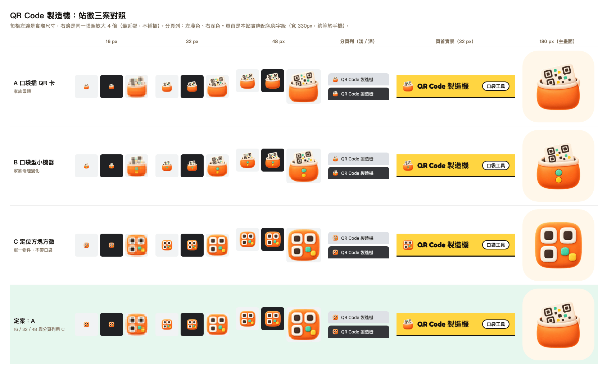

# QR Code 製造機的站徽

2026 年 9 月 26 日產品由 QR Code Studio 改名為 **QR Code 製造機**（英文 QR Code Maker），網址 `/qrcode-studio/` 不變，同時換上新的站徽。

## 設計方向

口袋工具的每個工具都用同一個母題：**口袋裡裝著這個工具的招牌物件**。口袋工具本身的圖示是水獺爪子從口袋探出來，
其他工具的口袋裡則放著各自的東西。風格是圓潤的軟陶感插畫，光從左上來，輪廓厚實，不含任何文字或字母。
口袋用本站的品牌橘 `#FF7A1A`，物件用對比的奶油白，點綴本站的糖果色（薄荷綠 `#36D399`、陽光黃 `#FFD12E`），
細節用深可可色。

站徽是點陣圖，由圖片生成模型產生三案再挑一案：這種插畫的厚實感與柔和明暗，手描向量做不出來。
圖上的 QR 圖案只有三個定位方塊與幾格色塊，**刻意不是掃得出來的真碼**（每張正本都用站上同一版解碼器確認過讀不到東西）。

## 三案與選擇



| 案 | 內容 | 結果 |
|---|---|---|
| A | 口袋裡插著一張 QR 卡 | **採用**：頁首、主畫面圖示、manifest、分享圖 |
| B | 口袋型的小機器吐出一張 QR 卡，機身有兩顆按鈕 | 未採用，原圖留在 [`candidate-b.png`](./candidate-b.png) |
| C | 三個定位方塊組成的圓角方徽，不帶口袋 | 當 A 的**分頁圖示簡化版**（favicon） |

比較順序是：32 px 還認不認得出物件，16 px 有沒有糊成一團，跟本站的黃色頁首與品牌橘協不協調，跟口袋工具其他工具是不是一家。

- **A 與 B** 都是口袋母題，在 32 px 以上都看得出「口袋裡有一張 QR 卡」，頁首實景也清楚。B 的兩顆按鈕在 48 px 以下變成兩個色點，
  反而讓口袋看起來像別的東西，而且物件多一個、畫面更擠，所以選 A。
- **A 在 16 px 只剩一團橘色加一條米色**，認不出 QR 卡。C 是同一批生成、同一組配色的簡化版，三個定位方塊在 16 px 仍然分得出來，
  所以分頁圖示（`favicon.svg`、`favicon.ico`）改用 C；32 px 以上的地方一律用 A。
- 橘色在淺色與深色分頁列上都看得見，所以分頁圖示不另外加底色。

## 檔案

| 檔案 | 內容 |
|---|---|
| `scripts/brand/logo-source.png` | 正本 A，512×512 透明 PNG |
| `scripts/brand/favicon-source.png` | 分頁圖示用的 C，512×512 透明 PNG |
| `scripts/brand/clean-logo.mjs` | 把生成的原圖整理成正本：清掉去背殘留的洋紅雜點與邊緣色偏、裁掉空白、置中縮成 512 |
| `scripts/brand/render.mjs` | 從兩張正本產生全部圖示與三張分享圖 |
| `scripts/brand/cards.mjs` | 分享圖上的文字（站名從 `src/config/site.ts` 讀） |
| `docs/brand/logo-compare.png` | 上面那張三案對照表 |
| `docs/brand/candidate-b.png` | 未採用的 B 案 |

`render.mjs` 產生到 `public/` 的檔案：

| 檔案 | 用途 | 來源 |
|---|---|---|
| `logo-64.png`、`logo-96.png` | 頁首站徽（顯示 32 px，2x／3x） | A |
| `favicon.svg` | 分頁圖示：SVG 外框內嵌 96 px PNG（整份約 7 KB） | C |
| `favicon.ico` | 16、32、48 px，舊瀏覽器與 Windows 捷徑 | C |
| `apple-touch-icon.png` | iOS 加入主畫面，180×180 不透明（紙色底，四周留約 19 px，不自己加圓角） | A |
| `icon-192.png`、`icon-512.png` | `manifest.webmanifest` 的圖示，不透明，站徽縮在中央 60%，被遮成圓形也切不到 | A |
| `og-default.png`、`og-scan.png`、`og-barcode.png` | 1200×630 分享圖，文字由 HTML 排版（不用生圖模型產字），掃描器與條碼那兩張裡的碼是真的、掃得出來 | A |

JSON-LD 的 `Organization.logo` 是出品方口袋工具的圖示（`public/pocketool-logo.png`），不是本產品的站徽，改站徽時不動它。

## 重產

```bash
# 只有重新生圖時才要：把生成的原圖整理成正本
node scripts/brand/clean-logo.mjs <原圖.png> scripts/brand/logo-source.png

# 圖示與分享圖（分享圖要 Playwright 與網路：標題字型是 Google Fonts 的 Noto Sans TC）
PLAYWRIGHT_MODULE=<playwright 套件目錄> node scripts/brand/render.mjs
```

產完用 `npm run build` 跑一次稽核：`seo:audit` 會驗每張分享圖是 1200×630、小於 300 KB，
apple-touch-icon 與 manifest 圖示不透明，頁首站徽、favicon、manifest 都帶 `/qrcode-studio/` 前綴而且檔案存在。
